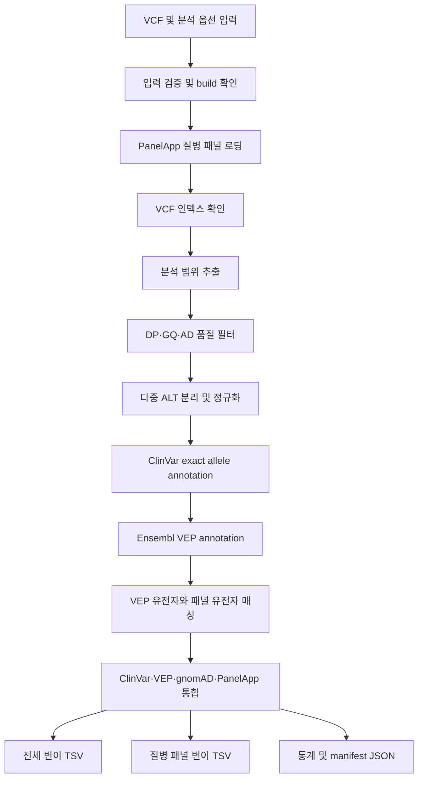

# VariantScope 파이프라인 처리 단계 및 UI 시각화 보고서 v1.0

작성일: 2026-07-27  
대상 코드: `scripts/run_vcf_annotation.py` v0.2.0  
분석 범위: germline WES small variant, 유전성 유방암·난소암 패널  
용도: 연구·교육용 MVP 및 프론트엔드·백엔드 구현 기준

---

## 1. 보고서 목적

VariantScope는 사용자가 VCF를 입력하면 단순히 최종 표만 보여주는 것이 아니라,
다음 내용을 분석 진행 화면에서 단계별로 보여주는 것을 목표로 한다.

1. 어떤 입력과 분석 옵션이 선택되었는가
2. 현재 어떤 도구가 무슨 작업을 수행하고 있는가
3. 각 단계 전후에 변이 수가 어떻게 달라졌는가
4. 중간 결과 파일이 무엇이며 다음 단계에서 어떻게 사용되는가
5. 어떤 데이터베이스 버전으로 annotation했는가
6. 실패했다면 어느 단계에서 무엇이 잘못되었는가

중요한 원칙은 원본 VCF를 덮어쓰지 않는 것이다. 각 단계는 새로운 파일을 만들고,
마지막 `manifest.json`에 입력·옵션·데이터 버전·출력 경로를 기록한다.

---

## 2. 현재 분석 시나리오

### 입력 데이터

```text
샘플: HG002
데이터 유형: germline WES에서 호출한 VCF
참조유전체: GRCh37/b37
샘플 수: 1
시험 범위: BRCA1 영역에서 호출한 7개 변이
```

### 사용자가 선택하는 옵션

```text
질병: 유전성 유방암·난소암
PanelApp panel ID: 635
Panel version: 3.0
패널 근거 수준: Green
필터 preset: balanced
VEP mode: REST, 소규모 공개 HG002 검증용
```

### 질병 패널

PanelApp `635 / signed-off v3.0`의 Green 유전자는 다음 8개다.

```text
ATM
BARD1
BRCA1
BRCA2
CHEK2
PALB2
RAD51C
RAD51D
```

이 선택은 “HG002가 유방암 환자”라는 뜻이 아니다. 동일한 VCF를 여러 질병 패널의
관점으로 분석할 수 있으며, 여기서는 유전성 유방암·난소암 관련 유전자만 우선
표시하겠다는 분석 범위 설정이다.

---

## 3. 전체 데이터 흐름



### 변이 수 변화 예시

현재 HG002 BRCA1 검증에서 이미 확인한 수치는 다음과 같다.

```text
Raw 호출 변이                  7개
balanced 필터 통과             2개
정규화 후 allele               2개 예상
BRCA1 패널 매칭                2개 예상
```

마지막 두 값은 업그레이드된 VEP 파이프라인을 실제 실행한 뒤 확정해야 한다.
현재 2개 변이는 모두 BRCA1 영역에 있으므로 패널 매칭 가능성이 높지만, 보고서에는
실행 전 예상값과 실행 후 확정값을 구분해서 표시해야 한다.

---

## 4. 단계별 처리 요약

| 단계 | 처리 | 핵심 도구/함수 | 입력 | 중간·최종 출력 | UI 핵심 표시 |
|---|---|---|---|---|---|
| 0 | 분석 요청 생성 | `parse_args()` | VCF, 질병, 필터, build | 분석 설정 | 파일명, 질병, preset |
| 1 | 입력 검증 | `inspect_vcf_assembly()`, `select_sample()` | 원본 VCF | 검증 결과 | GRCh37, sample, contig 방식 |
| 2 | 질병 패널 로딩 | `load_panel()` | Panel ID 635 | `panel.json` | 패널명, 버전, 유전자 8개 |
| 3 | 인덱스 확인 | `ensure_index()` | VCF, ClinVar VCF | `.tbi` 또는 `.csi` | 준비 완료 여부 |
| 4 | 범위 추출 | `bcftools view` | 원본 VCF | `subset.vcf.gz` | 추출 전후 변이 수 |
| 5 | 품질 필터 | `build_filter_expression()` | subset VCF | `filtered.vcf.gz` | 통과·제외 수와 기준 |
| 6 | 변이 정규화 | `bcftools norm` | filtered VCF | `normalized.vcf.gz` | allele split/realign 수 |
| 7 | 임상 주석 | `bcftools annotate` | normalized VCF, ClinVar | `clinvar.vcf.gz` | ClinVar 매칭 수 |
| 8 | 기능 주석 | VEP REST/local | ClinVar VCF | `vep.cache.json` | 처리 개수, gene/consequence |
| 9 | 패널 매칭 | `select_transcript()` | VEP 결과, 패널 유전자 | 패널 여부 플래그 | 패널 내 변이 수 |
| 10 | 결과 통합 | `build_result_rows()` | 모든 주석 | 2종 TSV | 우선순위 표 |
| 11 | 보고서 생성 | `bcftools stats`, manifest | 전체 단계 결과 | stats, manifest | 실행 요약·재현성 |

---

## 5. 단계 0: 분석 요청 생성

### 코드 위치

```text
parse_args(): run_vcf_annotation.py 53행 부근
main():       run_vcf_annotation.py 991행 부근
```

### 입력값

현재 CLI에서는 다음과 같이 입력한다.

```bash
python scripts/run_vcf_annotation.py \
  input.vcf.gz \
  all \
  results/annotation/sample_HBOC \
  clinvar_GRCh37.vcf.gz \
  --assembly GRCh37 \
  --filter-preset balanced \
  --panel-id 635 \
  --panel-version 3.0 \
  --panel-confidence green \
  --vep-mode rest
```

웹 UI에서는 다음 컨트롤로 변환한다.

| CLI 옵션 | UI 컨트롤 |
|---|---|
| `input.vcf.gz` | 파일 업로드 |
| `region` | 전체/특정 영역 segmented control |
| `--assembly` | 자동감지 기본, 필요 시 선택 메뉴 |
| `--filter-preset` | Balanced/Strict/Custom 선택 |
| `--panel-id` | 질병 선택 드롭다운 내부 값 |
| `--panel-version` | 화면에는 데이터 버전으로 표시 |
| `--vep-mode` | 서버 설정, 일반 사용자는 직접 선택하지 않음 |

### UI 표시 예

```text
분석명        HG002_HBOC_panel_v1
입력 파일     HG002_BRCA1_GRCh37.raw.vcf.gz
질병 패널     유전성 유방암·난소암
필터          Balanced
분석 범위     전체 입력 VCF
```

이 단계에서는 아직 변이를 변경하지 않는다.

---

## 6. 단계 1: 입력 검증과 참조유전체 확인

### 관련 함수

```python
inspect_vcf_assembly(vcf_path)
select_sample(vcf_path, requested_sample)
require_file(path, label)
```

### 수행 작업

1. 입력 VCF가 실제로 존재하는지 확인한다.
2. VCF header에서 1번 염색체 길이를 읽는다.
3. `249250621`이면 GRCh37, `248956422`이면 GRCh38로 판단한다.
4. 염색체 이름이 `1`인지 `chr1`인지 확인한다.
5. 샘플 이름과 샘플 수를 확인한다.
6. ClinVar VCF의 build와 contig 스타일이 같은지 검사한다.

### 데이터가 변하는가?

아니다. 이 단계는 읽기 전용 검증이다.

### UI에 보여줄 정보

```text
입력 파일 확인                 완료
참조유전체                     GRCh37
염색체 표기                    1, 2, 3 ...
샘플                           Sample_Diag-excap51-HG002-EEogPU
ClinVar build 호환성           일치
```

### 대표 오류

| 오류 | 사용자 메시지 |
|---|---|
| GRCh37 VCF + GRCh38 ClinVar | 참조유전체 버전이 일치하지 않습니다 |
| `chr1` + `1` 혼합 | 염색체 이름 형식이 일치하지 않습니다 |
| 여러 샘플 | 분석할 샘플을 선택해 주세요 |
| VCF 누락 | 입력 파일을 찾을 수 없습니다 |

---

## 7. 단계 2: 질병 패널 로딩

### 관련 함수

```python
json_request()
load_panel()
normalize_panel_payload()
confidence_name()
```

### 수행 작업

1. `panel_id=635`, `version=3.0`을 받는다.
2. 캐시 JSON이 있으면 네트워크 없이 재사용한다.
3. 캐시가 없거나 새로고침을 요청하면 PanelApp API를 호출한다.
4. 패널 메타데이터와 유전자 목록을 분리해서 읽는다.
5. Green 유전자만 남긴다.
6. 분석에 사용된 패널을 `panel.json`으로 저장한다.

### API

```text
패널 정보:
/api/v1/panels/635/?version=3.0

유전자 목록:
/api/v1/panels/635/genes/?version=3.0
```

### 중간 출력

```text
sample_HBOC.panel.json
```

### UI에 보여줄 정보

```text
질병 패널     유전성 유방암·난소암
출처          Genomics England PanelApp
Panel ID      635
Version       3.0
근거 수준     Green
유전자        8개
```

유전자 목록은 접을 수 있는 표로 제공한다.

| Gene | Evidence | Mode of inheritance |
|---|---|---|
| BRCA1 | Green | monoallelic/biallelic |
| BRCA2 | Green | monoallelic |
| PALB2 | Green | monoallelic |
| ATM | Green | monoallelic |

### UX 원칙

- API 실패 시 캐시를 사용하면 분석은 계속 진행한다.
- 보고서에는 실제 사용한 패널 버전을 고정해서 표시한다.
- 새 PanelApp 버전이 나와도 기존 분석 결과를 자동 변경하지 않는다.

---

## 8. 단계 3: VCF 인덱스 확인

### 관련 함수

```python
index_path_exists()
ensure_index()
```

### 수행 작업

압축 VCF에서 특정 위치를 빠르게 찾기 위해 `.tbi` 또는 `.csi` 인덱스가 있는지
확인한다. 없으면 `bcftools index`로 생성한다.

### 중간 출력

```text
input.vcf.gz.tbi 또는 input.vcf.gz.csi
clinvar.vcf.gz.tbi 또는 clinvar.vcf.gz.csi
```

### UI 표시

```text
입력 VCF 인덱스              준비 완료
ClinVar 인덱스               준비 완료
```

인덱스는 생물학적 결과가 아니므로 별도 결과 카드보다 준비 단계의 체크 표시가
적절하다.

---

## 9. 단계 4: 분석 범위 추출

### 실행 도구

```bash
bcftools view -r REGION input.vcf.gz -Oz -o output.subset.vcf.gz
```

`region=all`이면 `-r` 없이 전체 입력을 복사한다.

### 입력과 출력

```text
입력:  input.vcf.gz
출력:  sample_HBOC.subset.vcf.gz
인덱스 sample_HBOC.subset.vcf.gz.csi
```

### 데이터 가공

원본 VCF는 변경하지 않고 사용자가 지정한 염색체 구간만 남긴다. 전체 WES를
선택하면 이 단계는 분석 가능한 형식으로 복사하는 역할을 한다.

### UI 표시

```text
분석 범위        전체 입력 VCF
입력 변이 수     7
추출 변이 수     7
```

특정 영역을 입력했다면 염색체와 좌표도 표시한다.

---

## 10. 단계 5: 품질 필터링

### 관련 코드

```python
FILTER_PRESETS = {
    "balanced": {"min_dp": 5, "min_gq": 10, "min_alt_depth": 3},
    "strict": {"min_dp": 10, "min_gq": 20, "min_alt_depth": 3},
}
```

Balanced 필터 표현식:

```text
(FILTER="PASS" || FILTER=".")
&& FORMAT/DP >= 5
&& FORMAT/GQ >= 10
&& FORMAT/AD의 ALT depth >= 3
```

### 필드 의미

| 필드 | 의미 |
|---|---|
| DP | 해당 위치를 읽은 총 read 수 |
| GQ | genotype 호출 신뢰도 |
| AD | REF와 ALT를 지지하는 read 수 |
| FILTER | variant caller가 부여한 품질 상태 |

### 실행 도구

```bash
bcftools view -i FILTER_EXPRESSION subset.vcf.gz \
  -Oz -o filtered.vcf.gz
```

### 실제 HG002 BRCA1 사례

```text
필터 전   7개
필터 후   2개
제외      5개
통과율    28.6%
```

통과한 변이:

| Position | REF | ALT | GT | AD | DP | GQ |
|---|---|---|---|---|---:|---:|
| 17:41232344 | G | C | 1/1 | 0,5 | 5 | 15 |
| 17:41251931 | G | A | 0/1 | 184,185 | 369 | 99 |

### UI 표시

필터 단계에서는 기준과 결과를 동시에 보여주는 것이 중요하다.

```text
Balanced filter
DP ≥ 5    GQ ≥ 10    ALT depth ≥ 3

7개 중 2개 통과
5개 제외
```

제외된 변이도 삭제하지 않고 별도 확인 가능하게 한다. 각 행에는 다음과 같은
제외 사유를 붙이는 것이 좋다.

```text
DP 2 < 5
GQ 6 < 10
ALT depth 2 < 3
```

현재 코드는 통과 여부만 파일로 남기므로, UI에서 제외 사유를 보여주려면
후속 구현에서 각 기준별 boolean과 `filter_reason`을 추가해야 한다.

---

## 11. 단계 6: 변이 정규화

### 실행 도구

```bash
bcftools norm -m -any -f reference.fasta filtered.vcf.gz \
  -Oz -o normalized.vcf.gz
```

### 수행 작업

1. 하나의 위치에 ALT가 여러 개인 multiallelic record를 allele별로 분리한다.
2. indel 표현을 참조유전체 기준으로 정렬한다.
3. REF 염기가 FASTA와 일치하는지 확인한다.

### 필요한 이유

다음 두 표현이 생물학적으로 같은 indel이어도 좌표·REF·ALT가 다르면 ClinVar
exact match가 실패할 수 있다. 정규화는 데이터베이스 매칭 전에 표현을 통일한다.

### 중간 출력

```text
sample_HBOC.normalized.vcf.gz
sample_HBOC.normalized.vcf.gz.csi
```

### UI 표시

```text
입력 record             2
분리된 allele           2
realigned allele        0
REF mismatch            0
```

현재 코드는 `bcftools norm` 로그를 콘솔에 출력한다. UI에서 정확한 수치를 쓰려면
이 로그의 `total/split/joined/realigned/skipped` 값을 구조화해 저장해야 한다.

---

## 12. 단계 7: ClinVar annotation

### 실행 도구

```bash
bcftools annotate \
  -a clinvar_GRCh37.vcf.gz \
  -c ID,INFO/CLNSIG,INFO/CLNDN,INFO/CLNREVSTAT,INFO/CLNHGVS,INFO/GENEINFO \
  normalized.vcf.gz \
  -Oz -o clinvar.vcf.gz
```

### 매칭 기준

```text
assembly + CHROM + POS + REF + ALT
```

### 결합되는 정보

| 필드 | UI 표시명 | 의미 |
|---|---|---|
| ID | ClinVar ID | ClinVar 변이 식별자 |
| CLNSIG | 임상 분류 | Pathogenic, VUS, Benign 등 |
| CLNDN | 관련 질환 | 제출된 질환명 |
| CLNREVSTAT | 검토 수준 | single submitter, expert panel 등 |
| CLNHGVS | HGVS | ClinVar genomic HGVS |
| GENEINFO | Gene | ClinVar 유전자 기호와 Gene ID |

### 중간 출력

```text
sample_HBOC.clinvar.vcf.gz
sample_HBOC.clinvar.tsv
```

### UI 표시

```text
ClinVar 매칭        1개
미등록              1개
Expert panel 검토   1개
```

실제 숫자는 실행 후 계산한다. `ClinVar 미등록`은 `Benign`을 의미하지 않으므로
화면에서 회색 `No ClinVar record`로 표시한다.

### 중요한 제한

현재 ClinVar VCF의 `CLNSIG`는 변이 수준의 종합 요약이다. 유방암이라는 특정
질환에 대한 분류만 엄밀하게 보여주려면 후속 단계에서 ClinVar RCV 또는
`variant_summary.txt.gz`의 variant-condition 관계를 추가해야 한다.

---

## 13. 단계 8: Ensembl VEP annotation

### 실행 모드

| 모드 | 대상 | 특징 |
|---|---|---|
| REST | 공개 HG002 소규모 검증 | 설치 없이 빠르게 시험 |
| local | 전체 WES·민감 데이터 | 네트워크 전송 없이 재현 가능 |

### REST 처리

```text
최대 200개씩 batch
GRCh37 → https://grch37.rest.ensembl.org
GRCh38 → https://rest.ensembl.org
```

### VEP가 계산하는 정보

| 필드 | 의미 |
|---|---|
| gene | 겹치는 유전자 |
| transcript | 영향을 받는 전사체 |
| consequence | missense, intron, frameshift 등 |
| impact | HIGH, MODERATE, LOW, MODIFIER |
| HGVSc | 전사체 기준 변화 |
| HGVSp | 단백질 기준 변화 |
| canonical | 대표 전사체 여부 |
| SIFT/PolyPhen | 일부 missense 영향 예측 |
| gnomAD AF | 일반인구 allele frequency |

### 캐시

동일한 입력을 다시 실행할 때 API를 재호출하지 않도록 다음 파일에 저장한다.

```text
sample_HBOC.vep.cache.json
```

캐시에는 assembly와 입력 변이 목록의 SHA-256 digest도 기록되어, 다른 입력의
결과가 잘못 재사용되는 것을 막는다.

### UI 표시

```text
VEP annotation
처리 중 2 / 2

BRCA1    missense_variant
BRCA1    intron_variant
```

REST를 사용하면 다음 안내가 필요하다.

```text
공개 테스트 데이터의 변이 좌표와 allele을 Ensembl에 전송하고 있습니다.
```

환자 또는 민감 데이터에서는 local 모드만 허용해야 한다.

---

## 14. 단계 9: 질병 패널 매칭

### 관련 함수

```python
select_transcript()
build_result_rows()
```

### 처리 방식

VEP가 찾은 유전자 집합과 PanelApp 유전자 집합의 교집합을 계산한다.

```python
panel_matches = set(all_vep_genes) & set(panel_genes)
```

예:

```text
VEP genes       BRCA1
Panel genes     ATM, BARD1, BRCA1, BRCA2, CHEK2, PALB2, RAD51C, RAD51D
Intersection    BRCA1
Result          in_selected_panel = yes
```

패널 밖의 변이는 전체 결과에서 삭제하지 않는다.

```text
variants.tsv          모든 품질 통과 변이
panel_variants.tsv    선택한 질병 패널과 겹치는 변이
```

### 전사체 선택 우선순위

1. 선택 패널 유전자에 속하는 전사체
2. canonical 전사체
3. protein-coding 전사체
4. HIGH → MODERATE → LOW → MODIFIER impact

### UI 표시

```text
질병 패널 변이     2개
패널 밖 변이       0개

BRCA1              2개
나머지 7개 유전자  0개
```

유전자에서 변이가 발견되지 않았다는 사실과 해당 유전자가 충분히 분석되었다는
사실은 다르다. WES coverage가 낮았던 유전자는 별도의 coverage 경고가 필요하다.

---

## 15. 단계 10: 통합 결과 생성

### 주요 출력 필드

```text
chrom, pos, ref, alt
qual, filter, GT, AD, DP, GQ
gene, transcript, consequence, impact
HGVSc, HGVSp, canonical
SIFT, PolyPhen
ClinVar ID, significance, disease, review status
gnomAD exome AF, genome AF
in_selected_panel
panel confidence, inheritance, version
```

### 결과 파일

```text
sample_HBOC.variants.tsv
sample_HBOC.panel_variants.tsv
```

### 결과 표 권장 컬럼

첫 화면에는 모든 필드를 넣지 않고 의사결정에 필요한 컬럼만 우선 표시한다.

| Gene | Variant | Consequence | DP | GQ | ClinVar | Review | gnomAD AF |
|---|---|---|---:|---:|---|---|---:|
| BRCA1 | 17:... G>A | missense | 369 | 99 | Benign | Expert panel | 0.0001 |

행을 선택하면 상세 drawer 또는 상세 페이지에서 transcript, HGVS, SIFT,
PolyPhen, inheritance, 원본 FORMAT 정보를 보여준다.

### 상태 분류

```text
Pathogenic/Likely pathogenic    빨간색 아이콘 + 텍스트
VUS                             노란색 아이콘 + 텍스트
Benign/Likely benign            초록색 아이콘 + 텍스트
No ClinVar record               회색 아이콘 + 텍스트
```

색상만으로 상태를 전달하지 않고 반드시 텍스트를 함께 사용한다.

---

## 16. 단계 11: 통계와 manifest 생성

### 출력 파일

```text
sample_HBOC.subset.stats.txt
sample_HBOC.filtered.stats.txt
sample_HBOC.filter.txt
sample_HBOC.manifest.json
```

### manifest 내용

```json
{
  "pipeline_version": "0.2.0",
  "assembly": "GRCh37",
  "region": "all",
  "filter": {
    "preset": "balanced",
    "min_dp": 5,
    "min_gq": 10,
    "min_alt_depth": 3
  },
  "clinvar": {
    "file_date": "YYYYMMDD",
    "match": "normalized CHROM+POS+REF+ALT exact allele"
  },
  "vep": {
    "mode": "rest"
  },
  "panelapp": {
    "panel_id": 635,
    "version": "3.0"
  },
  "counts": {
    "filtered_alleles": 2,
    "selected_panel_alleles": 2
  }
}
```

### UI 표시

분석 완료 화면에 다음 정보를 제공한다.

```text
분석 완료
소요 시간              00:00:08
품질 통과 변이         2
질병 패널 변이         2
ClinVar 매칭           실행 후 계산
사용 데이터            PanelApp 635 v3.0
참조유전체             GRCh37
```

보고서 다운로드 메뉴:

- 통합 TSV
- 패널 TSV
- annotated VCF
- manifest JSON
- QC stats

---

## 17. UI 진행 화면 설계

### 권장 단계 표시

```text
1  입력 검증             완료
2  질병 패널 준비        완료
3  분석 범위 추출        완료
4  품질 필터링           완료 · 7 → 2
5  변이 정규화           완료 · 2 alleles
6  ClinVar annotation    완료 · 1 matched
7  VEP annotation        처리 중 · 1/2
8  질병 패널 매칭        대기
9  결과 보고서 생성      대기
```

진행률 숫자만 보여주기보다 단계 이름과 현재 변이 수를 같이 보여주는 것이
사용자에게 더 의미가 있다.

### 화면에 필요한 실시간 이벤트

```json
{
  "run_id": "run_20260727_001",
  "stage_id": "quality_filter",
  "stage_name": "품질 필터링",
  "status": "completed",
  "progress": 40,
  "input_count": 7,
  "output_count": 2,
  "message": "Balanced 기준을 통과한 변이 2개",
  "artifact": "sample_HBOC.filtered.vcf.gz",
  "started_at": "2026-07-27T13:00:01+09:00",
  "finished_at": "2026-07-27T13:00:02+09:00"
}
```

### 상태값

```text
queued
running
completed
warning
failed
```

---

## 18. 현재 코드와 UI 연동 시 필요한 변경

현재 Python 코드는 다음과 같은 콘솔 메시지를 출력한다.

```text
[13] Extracting target variants...
[14] Applying the selected quality filter...
[15] Splitting and normalizing alleles...
[16] Annotating exact alleles with local ClinVar...
[18] Annotating with Ensembl VEP REST...
[19] Combining annotation and disease-panel results...
[20] Creating statistics and resource manifest...
```

프로토타입에서는 백엔드가 이 로그를 읽어 진행 상태를 보여줄 수 있다. 하지만
실전 구현에서는 문자열 로그를 해석하지 말고 다음 중 하나를 추가하는 것이 좋다.

### 권장안: progress JSONL

Python 코드가 단계가 바뀔 때마다 다음 파일에 JSON 한 줄을 기록한다.

```text
results/runs/{run_id}/progress.jsonl
```

백엔드는 파일 또는 작업 큐의 상태를 읽어 프론트엔드에 전달한다.

### API 형태

```text
POST /api/runs
GET  /api/runs/{run_id}
GET  /api/runs/{run_id}/stages
GET  /api/runs/{run_id}/variants
GET  /api/runs/{run_id}/artifacts
```

프론트엔드는 1~2초 polling 또는 Server-Sent Events로 상태를 갱신할 수 있다.

---

## 19. 권장 백엔드 데이터 구조

### analysis_run

| 필드 | 예 |
|---|---|
| run_id | `run_20260727_001` |
| sample_name | `HG002` |
| input_filename | `HG002_BRCA1_GRCh37.raw.vcf.gz` |
| assembly | `GRCh37` |
| disease_key | `hereditary_breast_ovarian_cancer` |
| panel_id | `635` |
| panel_version | `3.0` |
| filter_preset | `balanced` |
| status | `running` |

### analysis_stage

| 필드 | 예 |
|---|---|
| run_id | `run_20260727_001` |
| stage_id | `clinvar_annotation` |
| status | `completed` |
| input_count | `2` |
| output_count | `2` |
| matched_count | `1` |
| artifact_path | `sample_HBOC.clinvar.vcf.gz` |

### variant_result

`variants.tsv`의 주요 컬럼을 저장한다. 전체 VCF 원문을 데이터베이스에 모두
복제하기보다 화면 조회에 필요한 정규화 필드와 원본 artifact 경로를 저장한다.

### resource_version

| source | version |
|---|---|
| reference | GRCh37/b37 |
| ClinVar | VCF header의 fileDate |
| Ensembl VEP | REST 또는 local 116 |
| gnomAD | VEP cache/source version |
| PanelApp | 635 v3.0 |

---

## 20. 예외 상황의 UI 처리

| 상황 | 분석 상태 | UI 처리 |
|---|---|---|
| 필터 통과 변이 0개 | 완료 | 오류가 아니라 `No variants passed` 표시 |
| 패널 매칭 0개 | 완료 | 전체 변이 결과는 유지하고 패널 결과 0개 표시 |
| ClinVar 미등록 | 완료 | `No ClinVar record` |
| PanelApp API 실패 + 캐시 존재 | warning | 캐시 버전으로 계속 분석 |
| PanelApp API 실패 + 캐시 없음 | failed | 패널 데이터를 준비하지 못함 |
| VEP REST 제한 초과 | failed | local VEP 사용 안내 |
| build 불일치 | failed | GRCh37/GRCh38 불일치 명시 |
| REF FASTA 불일치 | failed | 참조 FASTA와 VCF build 확인 안내 |
| WES coverage 부족 | warning | 변이 없음과 분석 불충분을 구분 |

---

## 21. MVP 화면 구성

### 화면 1: 분석 생성

- VCF 업로드
- 샘플 선택
- 질병 선택
- 필터 preset 선택
- 전체/특정 영역 선택
- 분석 시작

### 화면 2: 분석 진행

- 단계별 progress
- 입력·출력 변이 수
- 현재 사용 중인 데이터 소스
- warning과 error

### 화면 3: 결과 요약

- 총 입력 변이
- 필터 통과 변이
- 패널 변이
- ClinVar 분류별 개수
- consequence별 개수
- 유전자별 개수

### 화면 4: 변이 테이블

- Gene, Variant, Consequence
- DP/GQ/AD
- ClinVar significance/review
- gnomAD AF
- 필터와 정렬

### 화면 5: 변이 상세

- 모든 VEP transcript
- HGVSc/HGVSp
- ClinVar 질환·검토 정보
- population frequency
- 원본 genotype 품질
- 외부 데이터베이스 링크

### 화면 6: 보고서

- 실행 조건
- 자원 버전
- QC 결과
- 선택된 변이
- 제한 사항
- TSV/VCF/JSON 다운로드

---

## 22. 구현 우선순위

### 1차

1. 현재 Python 스크립트 실행
2. 단계별 JSON progress 기록
3. `manifest.json`과 TSV를 API로 반환
4. 진행 화면과 결과 테이블 연결

### 2차

1. custom 필터 UI
2. ClinVar 질환별 RCV 정보
3. local VEP worker
4. coverage 및 callable 영역 표시
5. 여러 질병 패널 지원

### 3차

1. 분석 이력과 재실행
2. 데이터 버전 업데이트 관리
3. 사용자 역할과 접근제어
4. PDF/Word 보고서 생성

---

## 23. 완료 기준

다음 항목이 모두 확인되면 UI 연동용 파이프라인 MVP가 완성된 것으로 본다.

- 동일한 입력·버전·옵션에서 같은 결과가 생성된다.
- 원본 VCF가 변경되지 않는다.
- 모든 단계의 시작·완료·실패 상태가 저장된다.
- 단계별 input/output variant count가 표시된다.
- GRCh37/GRCh38 불일치를 실행 전에 차단한다.
- 패널 밖 변이를 전체 결과에서 보존한다.
- ClinVar 미등록을 benign으로 표시하지 않는다.
- 패널과 데이터베이스 버전이 보고서에 남는다.
- 전체 WES 또는 민감 데이터는 local VEP로 처리한다.
- 모든 결과에 연구·교육용이라는 제한을 표시한다.

---

## 24. 현재 상태

| 항목 | 상태 |
|---|---|
| 품질 필터 Python 코드 | 완료 |
| GRCh37/GRCh38 자동 검증 | 완료 |
| ClinVar build 자동 선택 | 완료 |
| PanelApp 635/v3.0 캐시 | 완료 |
| PanelApp API 계약 | 구현 완료 |
| VEP REST/local 모드 | 구현 완료 |
| 통합 TSV/manifest | 구현 완료 |
| Python 단위 테스트 | 6개 통과 |
| WSL 실제 통합 실행 | 설치 후 확인 필요 |
| progress JSON 이벤트 | 다음 구현 대상 |
| 웹 UI 연동 | 다음 구현 대상 |

---

## 25. 공식 데이터 출처

- PanelApp panel 635:  
  https://panelapp.genomicsengland.co.uk/panels/635/
- Ensembl VEP:  
  https://www.ensembl.org/info/docs/tools/vep/index.html
- ClinVar:  
  https://www.ncbi.nlm.nih.gov/clinvar/intro/
- gnomAD:  
  https://gnomad.broadinstitute.org/

---

## 26. 결론

현재 VariantScope 파이프라인은 VCF를 한 번에 덮어쓰는 방식이 아니라 단계마다
검증 가능한 중간 파일을 생성한다. UI는 이 구조를 그대로 반영하여 “무엇을
실행 중인지”와 “변이 수가 어떻게 바뀌었는지”를 보여주면 된다.

가장 중요한 다음 개발 항목은 Python 스크립트에 구조화된 progress event를
추가하는 것이다. 그러면 프론트엔드는 터미널 로그를 해석하지 않고도 각 단계,
변이 수, 경고, 산출물을 안정적으로 표시할 수 있다.
